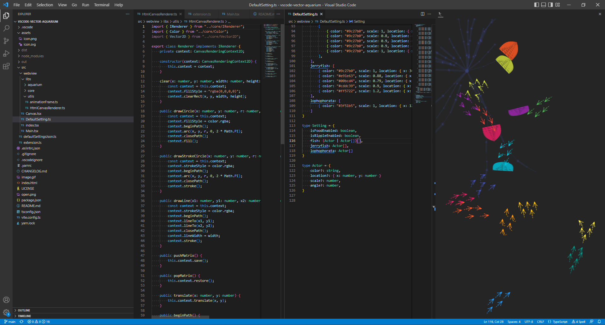
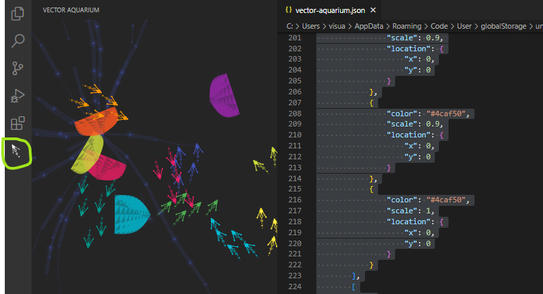
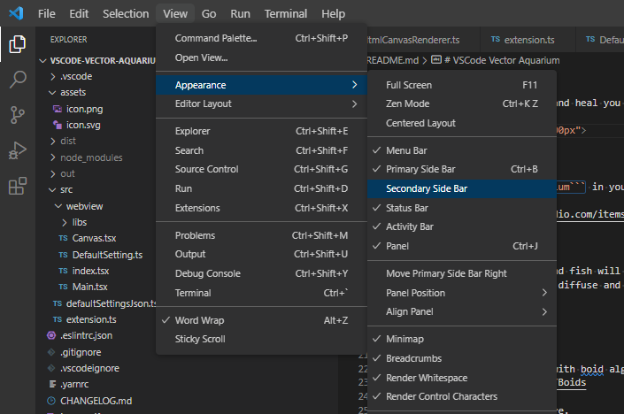
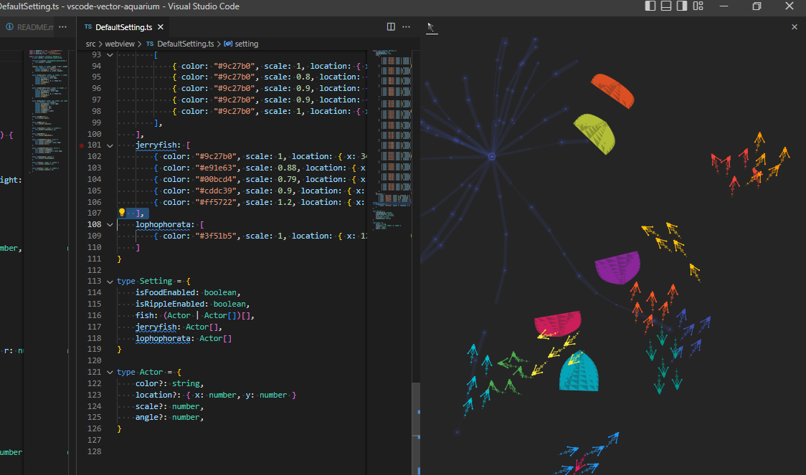

# 🐟🐠🐡 VSCode Vector Aquarium 🦪🦈🐚

[English](README.md) / [日本語](README-JP.md)

VSCode を水族館にして、癒やされましょう！




## UniAquarium

Unity Editor 向けのバインディング

https://github.com/Garume/UniAquarium?tab=readme-ov-file

## Install

VSCode の拡張機能タブで ```vscode-vector-aquarium``` を検索するか、以下の URL からインストールしてください。

[URL](https://marketplace.visualstudio.com/items?itemName=le-nn.vscode-vector-aquarium)

## Features

* タップするとエサが出現し、魚が追いかけて食べます。
* 魚をタップすると、魚が散らばって逃げます。
* 他の生き物たちも泳ぎます。
* 群れになった魚は集団で泳ぎます。

## How it works

魚の群れは、Boid アルゴリズムによって実装されています。
[URL](https://en.wikipedia.org/wiki/Boids)

描画や移動ロジックはこちら：
[ソースコード](https://github.com/le-nn/vscode-vector-aquarium/tree/main/src/webview/libs)

## Usage

拡張機能タブを開きます。



### View on secondary side bar

セカンダリーサイドバーに表示する

```表示(View) > 外観(Appearance) > セカンダリーサイドバー(Secondary Side Bar)``` を有効にしてください。

その後、プライマリーサイドバーから魚アイコンをドラッグし、セカンダリーサイドバーへドロップすると表示できます。




## Setting

F1 キーを押して、以下のコマンドを入力してください。

```
vscode-vector-aquarium.config
```

設定ファイルが開きます。

設定例はこちらです。

```fish``` フィールドは魚の群れを表します。
配列の子要素ひとつが「1つの群れ」であり、その中の要素が「1匹の魚」を表しています。

以下は設定例です。

```json
{
    "isFoodEnabled": true,
    "isRippleEnabled": true,
    "fish": [
        [
            {
                "color": "#3f51b5",
                "scale": 1,
                "location": {
                    "x": 0,
                    "y": 0
                }
            },
            {
                "color": "#3f51b5",
                "scale": 1,
                "location": {
                    "x": 0,
                    "y": 0
                }
            },
        ],
        [
            {
                "color": "#2196f3",
                "scale": 0.9,
                "location": {
                    "x": 0,
                    "y": 0
                }
            },
            {
                "color": "#2196f3",
                "scale": 1,
                "location": {
                    "x": 0,
                    "y": 0
                }
            }
        ]
    ],
    "jerryfish": [
        {
            "color": "#9c27b0",
            "scale": 1,
            "location": {
                "x": 340,
                "y": 120
            }
        },
        {
            "color": "#e91e63",
            "scale": 0.88,
            "location": {
                "x": 120,
                "y": 230
            }
        }
    ],
    "lophophorata": [
        {
            "color": "#3f51b5",
            "scale": 1,
            "location": {
                "x": 120,
                "y": 200
            }
        }
    ]
}

```

## License

♥ を込めて le-nn により制作されています。
MIT ライセンスのもとで公開されています。