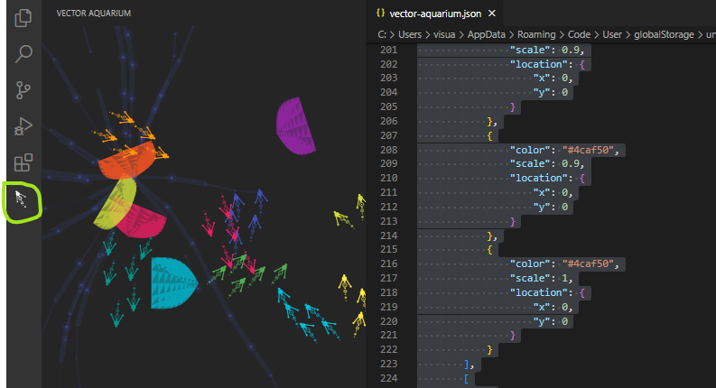

# VSCode Vector Aquarium

Make your vscode an aquarium and heal you !


## Install

Search ```vscode-vector-aquarium``` your vscode extension tab or install from following url.

https://marketplace.visualstudio.com/items?itemName=le-nn.vscode-vector-aquarium

## Features

* When tapped, bait appears and fish will chase and eat it.
* When fish tapped, fish will diffuse and escape.
* Other creature will swim.

## Usage

Open extension tab.



## Setting

Press F1 and input following command.

```
vscode-vector-aquarium.config
```

And setting file will open.
Here is example of settings.
The ```fish``` field represents a swarm of fish.
One child of array is one swarm. Its child field represents one fish.
The setting example is as the field name.

```json
{
    "isFoodEnabled": true,
    "isRippleEnabled": true,
    "fish": [
        [
            {
                "color": "#3f51b5",
                "scale": 1,
                "location": {
                    "x": 0,
                    "y": 0
                }
            },
            {
                "color": "#3f51b5",
                "scale": 1,
                "location": {
                    "x": 0,
                    "y": 0
                }
            },
        ],
        [
            {
                "color": "#2196f3",
                "scale": 0.9,
                "location": {
                    "x": 0,
                    "y": 0
                }
            },
            {
                "color": "#2196f3",
                "scale": 1,
                "location": {
                    "x": 0,
                    "y": 0
                }
            }
        ]
    ],
    "jerryfish": [
        {
            "color": "#9c27b0",
            "scale": 1,
            "location": {
                "x": 340,
                "y": 120
            }
        },
        {
            "color": "#e91e63",
            "scale": 0.88,
            "location": {
                "x": 120,
                "y": 230
            }
        }
    ],
    "lophophorata": [
        {
            "color": "#3f51b5",
            "scale": 1,
            "location": {
                "x": 120,
                "y": 200
            }
        }
    ]
}

```

## License

Designed with ♥ by le-nn. Licensed under the MIT License.
